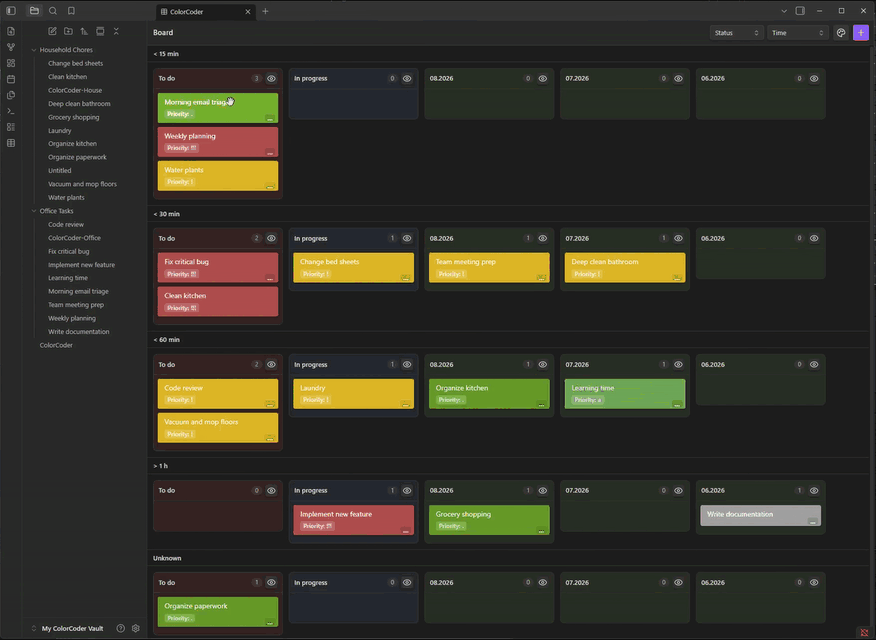
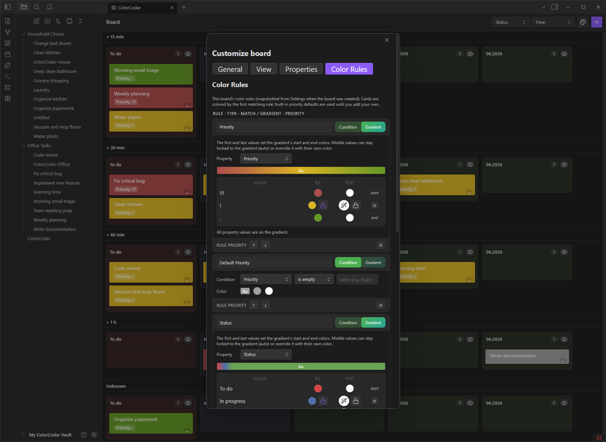

# ColorCoder Tables

**A Notion-like 2D Kanban/Swimlane board for Obsidian with Task-as-File architecture, typed properties, and dynamic color coding.**


---

## 🎬 Visuals

### Board Demo — Color-coded 2D Kanban with Drag & Drop



*Color-coded board, drag & drop between columns/swimlanes, hiding groups and swimlanes*

### Color Rules Settings



*Condition rules + Gradient rules with live preview, priority ordering, per-board overrides*

---

## 🌱 Origin & Motivation

**ColorCoder Tables** was born from a personal need: I wanted the power of Notion's databases and Kanban boards *inside* Obsidian—without leaving my vault, without cloud sync, and with full ownership of my data as Markdown files.

As a solo developer (**jaho123i**), I built this plugin to solve my own workflow gaps and to give back to the incredible Obsidian community that has given me so much. Every feature exists because I needed it daily. If it helps you too, that's the best reward.

> **No hidden telemetry • No cloud dependency • Your vault, your rules**

---

## ✨ Features

| Feature | Description |
|---------|-------------|
| **🎯 Task-as-File Architecture** | Every task is a Markdown file with YAML frontmatter. No proprietary database—just plain text you can version, grep, and script. |
| **📋 2D Kanban + Swimlanes** | Columns (group by any property) × Swimlanes (second dimension). Drag cards to update values instantly. |
| **⚡ Notion-like Quick Add Modal** | Press a hotkey → typed form appears with dropdowns, date pickers, toggles, multi-selects—all based on your property schema. |
| **🏷️ Typed Properties with Validation** | Text, Number, Checkbox, Date/DateTime, Select, Multi-select, Reference. Auto-adoption detects existing vault properties. |
| **🎨 Dynamic Color Coding** | Condition rules (Priority = High → red) + Gradient rules (progress bars across values). Per-board or global defaults. |
| **🔄 Virtual Grouping** | Group tasks by shared property values across folders—solves the "directory problem" elegantly. |
| **📦 Segmented Views** | Split boards into segments by project type, duration, or custom criteria. |
| **📥 Notion Import** | Export a Notion database as Markdown → import → every row becomes a task with all properties preserved. |
| **🔧 Per-Board Customization** | Each board snapshots settings at creation. Global defaults never override existing boards unless you explicitly apply them. |
| **📱 Mobile-First** | Touch-friendly drag & drop, Capacitor back-button support, responsive UI. |
| **🌙 Dark Mode Native** | Uses Obsidian CSS variables—looks great in any theme. |

---

## 🚀 How to Use

### 1. Create Your First Board

* **Command Palette** → `Create ColorCoder Board` → pick a folder
* **Right-click a folder** in the file explorer → `Create ColorCoder board here`
* A board file (`<name>-board.md`) is created. It reads tasks from that folder **and all subfolders**.

### 2. Add Tasks — The Quick Add Way

1. Open the board (or run `Quick Add Task` from anywhere)
2. Pick the target board from the picker
3. Fill in the typed form:

   * **Select/Multi-select** → dropdown with your defined options
   * **Date** → native date picker (toggle "Include time" for datetime)
   * **Checkbox** → toggle
   * **Number** → numeric input with validation
   * **Reference** → file path input
4. Hit **Create** → task file appears instantly on the board

### 3. Organize with Drag & Drop

* **Drag between columns** → updates the group-by property (e.g., Status: Todo → In Progress)
* **Drag between swimlanes** → updates the swimlane property (e.g., Priority: Low → High)
* **Drag within column** → reorders cards (persisted per-group)

### 4. Color Code Your Way

Open **Settings → ColorCoder Tables → Color Rules** (or board **Customize → Color Rules**):

* **Condition Rules**: `Property` + `Operator` + `Value` → `Background/Text Color`
* **Gradient Rules**: Pick a property → each value gets an interpolated color between start/end
* **Priority**: Drag rules to reorder (first match wins)

### 5. Customize Per Board

Click the **paint palette icon** (or `Customize board` command) on any board:

* **General**: Cards per column, panel tinting, font size, compact toolbar
* **View**: Column/swimlane order, sort mode, visible groups, card fields
* **Properties**: Types, options, hide/exclude, auto-adopt new ones
* **Color Rules**: Board-specific overrides

### 6. Import from Notion

1. Export Notion database as **Markdown & CSV**
2. Run `Import Notion Export` command
3. Pick source folder → pick destination vault folder
4. Every row with frontmatter becomes a task; database pages skipped; board created automatically

---

## 📦 Installation

### Option 1: Community Plugins (Recommended)

1. Open **Settings → Community Plugins → Browse**
2. Search for **"ColorCoder Tables"**
3. Click **Install** → **Enable**

### Option 2: Manual Installation

1. Go to the [Releases page](https://github.com/jaho123i/ColorCoder_Tables_System/releases)
2. Download the latest release assets:

   * `main.js`
   * `manifest.json`
   * `styles.css`
3. Copy all three files to:

```
<your-vault>/.obsidian/plugins/colorcoder-tables/
```

4. Reload Obsidian → enable **ColorCoder Tables** in Community Plugins

### Option 3: BRAT (For Beta Testing)

1. Install **BRAT** (Beta Reviewers Auto-update Tool) from Community Plugins
2. In BRAT settings → `Add Beta Plugin` → paste this repo URL:

```
https://github.com/jaho123i/ColorCoder_Tables_System
```

3. BRAT will fetch the latest build and keep it updated

---

## 💬 Feedback & Contact

| Channel | Purpose |
|---------|---------|
| **GitHub Issues** | 🐛 Bug reports, 💡 Feature requests, 📝 Documentation improvements |
| **Obsidian Discord** | 💬 Quick questions, 🤝 Community discussion, 🙋‍♂️ Tag **@jaho123i** |

> **Please use GitHub Issues for anything that needs tracking.** Discord is great for chat, but issues get lost there.

---

## ❤️ Support / Funding

**ColorCoder Tables is completely free** — no paywalls, no locked features, no tracking.

There are **no donation links set up yet**. If you find this plugin highly valuable and want to support development financially, just let me know via **GitHub Issues** or ping **@jaho123i on Discord** — I'll gladly add a Ko-fi / GitHub Sponsors link!

Your feedback, bug reports, and kind words are already the best fuel for this project. 🚀

---

## 📄 License

**MIT License** — see [LICENSE](LICENSE) for details.

---

## 🙏 Acknowledgments

* The **Obsidian Team** for an extensible, developer-friendly platform
* The **Obsidian Community** for inspiration, API docs, and peer support
* **@dnd-kit** for the excellent drag-and-drop primitives
* **@tanstack/react-table** for headless table logic

---

*Built by [jaho123i](https://github.com/jaho123i).*